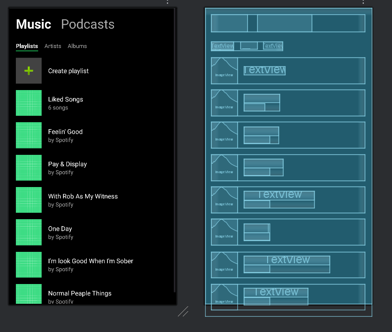

  <h1>
    Clone da Interface do Spotify (Tela Inicial)
  </h1>

  
  
  

  Uma recriação fiel da tela inicial do Spotify para Android, focada na construção de grids e listas horizontais para exibição de conteúdo musical.

  <a href="#-sobre-o-projeto">Sobre</a> •
  <a href="#-tecnologias-utilizadas">Tecnologias</a> •
  <a href="#-como-usar">Como Usar</a> •
  <a href="#-demonstração">Demonstração</a> •
  <a href="#-licença">Licença</a>

---

### 🎯 Sobre o Projeto

Este projeto replica a tela inicial do Spotify e foi desenvolvido como um desafio de UI para o portfólio. O principal objetivo foi dominar a criação de layouts dinâmicos que misturam grades (`GridLayout`) e listas roláveis (`HorizontalScrollView`), componentes essenciais para qualquer aplicativo de streaming ou galeria. O projeto, originado de uma atividade acadêmica, demonstra a capacidade de organizar uma grande quantidade de informações visuais de forma coesa e agradável.

---

### 🛠️ Tecnologias Utilizadas

A interface foi construída utilizando as ferramentas padrão do desenvolvimento Android nativo.

  
  
  

---

### ⚙️ Como Usar

Para visualizar este layout:
1.  Crie um novo projeto no Android Studio.
2.  Copie o conteúdo do arquivo `spotify.xml` para o seu arquivo de layout principal (ex: `res/layout/activity_main.xml`).
3.  Na sua `MainActivity.kt` ou `MainActivity.java`, certifique-se de que o layout está sendo carregado: `setContentView(R.layout.activity_main)`.
4.  Execute o aplicativo em um emulador ou dispositivo físico.

---

### 🎬 Demonstração

  

<strong>💡 Análise da Estrutura do Layout (Write-up)</strong>

 

A interface do Spotify é rica em conteúdo visual, e sua estrutura em XML foi planejada da seguinte forma:

1.  **Layout Raiz (`ScrollView` e `ConstraintLayout`)**: Um `ScrollView` vertical permite a rolagem da página inteira. Dentro dele, um `ConstraintLayout` serve como base para organizar as diferentes seções de conteúdo.

2.  **Cabeçalho (Header)**: Contém a saudação ("Boa tarde") e ícones de ação (`ImageViews`), posicionados com precisão usando `ConstraintLayout`.

3.  **Grid de Músicas Recentes (`GridLayout`)**: A seção "Tocadas recentemente" foi implementada com um `GridLayout`. Este tipo de layout é perfeito para organizar elementos em colunas e linhas, garantindo que os cards de playlist/álbum fiquem alinhados corretamente. Cada item da grade é um `CardView` contendo uma `ImageView` e um `TextView`.

4.  **Listas Horizontais (`HorizontalScrollView`)**: Para as seções como "Feito para Marcos" e "Sua vibe de hoje", foi utilizada a abordagem de `HorizontalScrollView`. Cada uma dessas seções contém um `TextView` como título e um `HorizontalScrollView` que, por sua vez, contém um `LinearLayout` com os cards de álbuns/playlists. Isso permite que o usuário explore o conteúdo de cada categoria sem poluir a tela verticalmente.

5.  **Player Fixo (`LinearLayout`)**: A barra "Tocando agora", que fica na parte inferior, foi posicionada de forma a sobrepor a barra de navegação. Ela é um `LinearLayout` horizontal que contém a arte do álbum, o título da música e os controles de play/pause. Em uma implementação real, este seria um fragmento separado ou uma view customizada.

6.  **Barra de Navegação (`LinearLayout`)**: Fixada na parte inferior, contém os ícones de Início, Buscar e Sua Biblioteca, com pesos distribuídos para ocupar o espaço de forma igualitária.

---

### 📝 Licença

Este projeto está sob a licença MIT.

  Desenvolvido por <b>Marcos Vinícius Rocha Silva</b>

